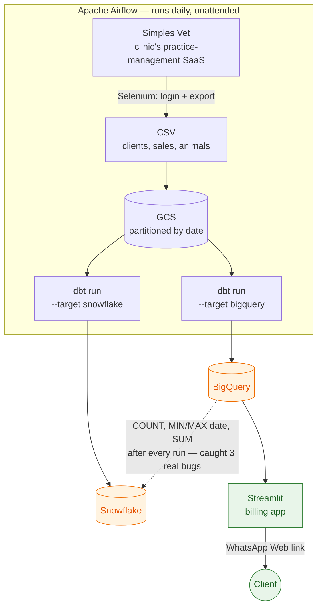

# FisioVet Data Platform

A production Airflow pipeline that scrapes a veterinary physiotherapy clinic's practice-management system,
lands the data in Google Cloud Storage, and transforms it with dbt into **two warehouses in parallel**
(BigQuery and Snowflake) — plus a Streamlit billing app built on top of it. Runs daily, unattended, on a
personal machine via Windows Task Scheduler.

This is a real system used by a real small business, built and operated solo. It is not a tutorial project.

## What it does

- **Extract**: Selenium logs into the clinic's SaaS (no headless API available) and exports clients, sales,
  and animals as CSV.
- **Load**: raw CSVs land in GCS, partitioned by date; both warehouses read the *same* files through
  external tables — no data is copied from one warehouse to the other.
- **Transform**: dbt models (one project, two targets) turn raw exports into typed tables and analytics
  marts — revenue by client/employee, P&L, an accounts-receivable queue.
- **Serve**: a Streamlit app (own Docker Compose, BigQuery-backed) replaced a manual "screenshot each
  client's balance and paste into WhatsApp" process with a real queue, editable message templates,
  send-via-WhatsApp-Web links, and a per-cycle audit trail.
- **Orchestrate**: a hardened PowerShell script brings Docker up, triggers the DAG, waits for completion,
  and tears Docker back down — so the pipeline runs daily without a machine staying on 24/7.



## Engineering notes worth reading

The interesting part of this repo isn't the happy path — it's what broke and how it was found.

- **A strict parity check caught three real, silent data bugs.** Comparing `COUNT`, `MIN/MAX(date)` *and*
  `SUM()` between the two warehouses after every run — not just "the job succeeded" — surfaced:
  - Snowflake's `INSERT OVERWRITE` incremental strategy silently **truncating an entire table** instead of
    swapping partitions like BigQuery does, quietly dropping months of history on every incremental run;
  - `NUMERIC` meaning `NUMBER(38,0)` in Snowflake vs. a 9-decimal type in BigQuery, rounding every currency
    value to whole units;
  - A daily export window that "aged out" old partitions in GCS, freezing them as stale snapshots and making
    already-paid clients look like they still owed money.
- **Reproducible infrastructure as versioned SQL/scripts**, not click-ops: every Snowflake object
  (storage integration, external tables, RBAC) and every GCP IAM grant is a numbered, re-runnable script,
  because the Snowflake account is a trial that can expire and needs to be rebuilt from scratch on demand.
- **The billing app is tested against a real warehouse, not mocks** — parametrized queries only (no
  string-built SQL), `MERGE`-based upserts (BigQuery enforces no primary keys), disposable sentinel rows for
  write tests, and a full send-flow test using `streamlit.testing.v1.AppTest`.
- **Least-privilege IAM throughout**: the ETL service account went from project `Editor` to scoped
  `bigquery.dataEditor` + bucket-level `storage.objectAdmin`; the billing app's service account can only
  write to its own dataset and only read the others.

## Stack

| Layer | Tech |
|---|---|
| Orchestration | Apache Airflow 2.10 (CeleryExecutor), Docker Compose |
| Extraction | Python, Selenium |
| Storage | Google Cloud Storage (external tables) |
| Transform | dbt (multi-warehouse: BigQuery + Snowflake) |
| App | Streamlit, `google-cloud-bigquery` |
| Ops | PowerShell (Windows Task Scheduler), pytest-style tests |

## Layout

```
dags/FisioVet/        Airflow DAG + dbt project (native/analytics/cobranca models, two targets)
dags/FisioVet/.dbt/snowflake_setup/   Versioned DDL to rebuild the Snowflake account from zero
plugins/               Shared hooks/operators (common/, fisiovet/, weather/)
apps/cobranca/         Streamlit billing app (its own Compose stack, tests included)
gcp_setup/             Every IAM/GCP command run against the project, as copy-pasteable scripts
scripts/               Daily automation (Task Scheduler wrapper, on-demand refresh)
```

A second, smaller pipeline (`dags/WeatherAPI/`) ingests a public weather API into BigQuery — kept in the
same repo as a second example of the same Airflow/dbt pattern against a simpler source.

## Status

Actively developed and in daily use. ~50 commits since mid-2024, most recent work adding the billing app,
migrating Snowflake auth to key pairs ahead of its password-login deprecation, and fixing the parity bugs
above. Not designed to be run by anyone else — it authenticates against one specific business's systems —
but every file is real, and the commit history is real.

## Author

**Pedro Gerolin** — Specialist Data Engineer at Cruzeiro do Sul Educacional (GCP/BigQuery/Dataform by day).
This repo is where I build with the tools my day job doesn't touch yet.
[LinkedIn](https://www.linkedin.com/in/pedrogerolin/) · pedro_gerolin@yahoo.com.br

## License

MIT — see [LICENSE](LICENSE).
